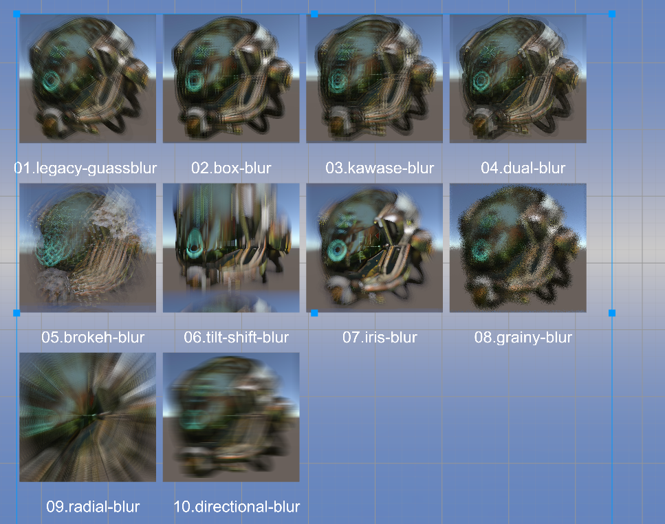
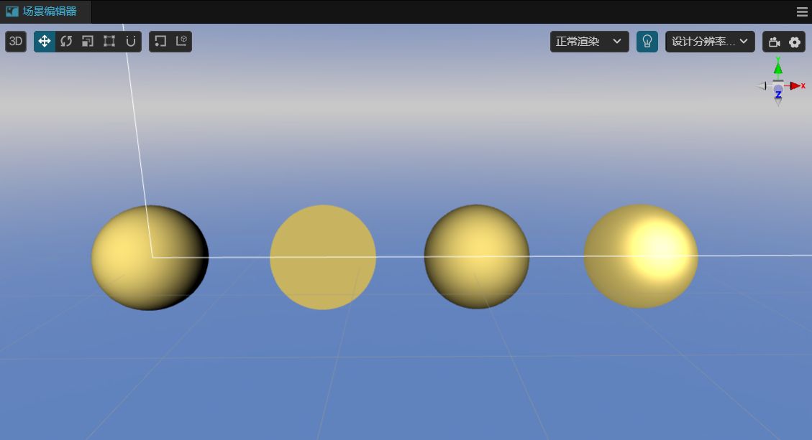
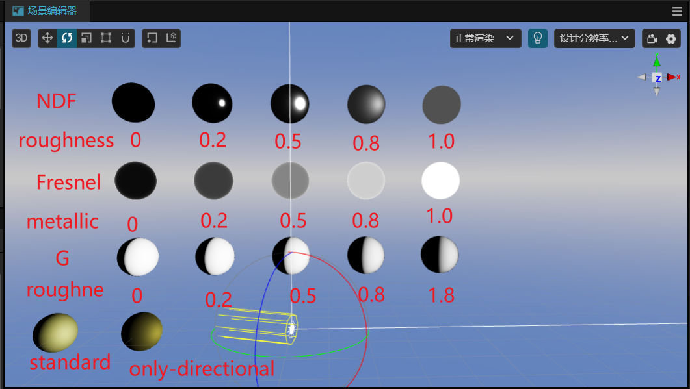

# 常见 Shader 合集

本文为学习shader时，在游戏开发中常见的 shader 合集。

- dissolve 消融效果

  

- guassblur 模糊效果
  
  

- scan 基于屏幕深度的贴花实现扫描和手雷的效果

  
   
  

- z-write-occlusion 基于深度测试的角色被遮挡时的效果

  

- lighting 光照模型
  - legacy 基础光照模型
  
  
  - ggx pbr 基础物理渲染学习

  