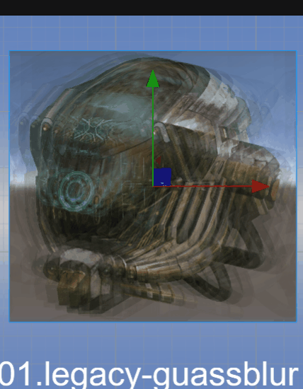
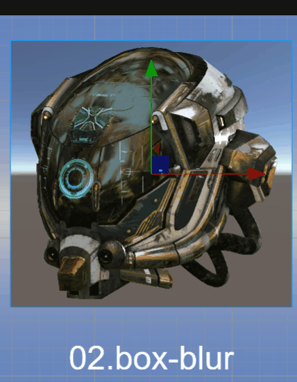
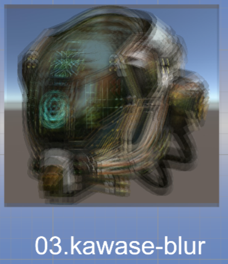
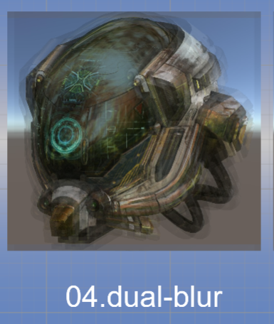
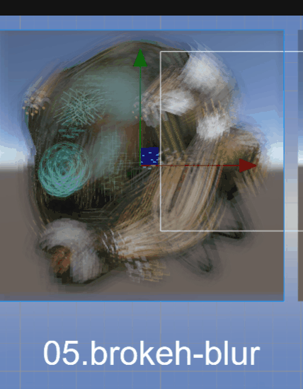
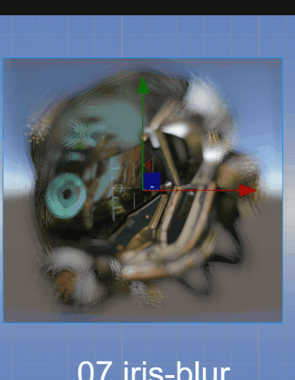
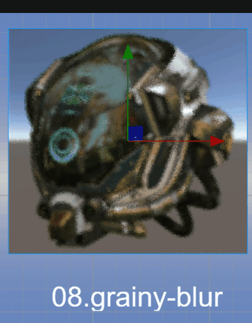
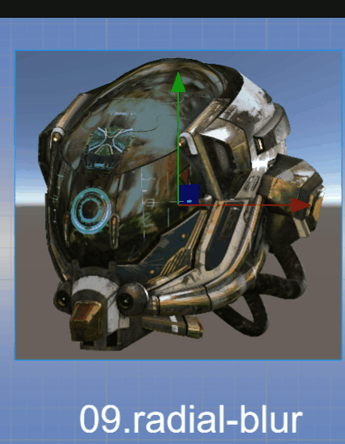
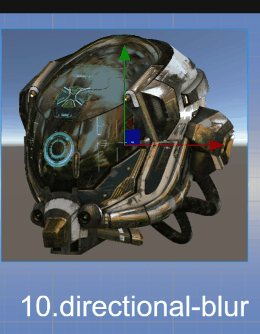

# 图像模糊算法

本文将 [浅墨的游戏编程-高品质后处理：十种图像模糊算法的总结与实现](https://zhuanlan.zhihu.com/p/125744132) 中基于 Unity 的实现，移植到了 Cocos。对原理感兴趣的可移步观看。

## 目录详解

- effect：存放着色器
- material: 材质
- texture: 存放纹理

## 使用方法

- 导入自己的项目：在 material 目录选中任意材质，右键选择 **导出资源** 将相关的资源导出成 zip  
- 在自己的项目的 **资源管理器** 内空白处鼠标右键，选择 **导入资源** 选中刚才的 zip 文件
- 将对应的材质给与需要的模型
- 在材质的属性检查器上勾选 **USE_TEXTURE** 之后请务必要勾选 **USE_XXXXBLUR**（此处的 XXXX 为 Blur 的名字）。
- 调整参数达到目标效果

## Blur 描述

- 01.legacy-guassblur.mtl 高斯模糊（Gaussian Blur）

    

- 02.box-blur.mtl 方框模糊（Box Blur）

    

- 03.kawase-blur.mtl Kawase模糊（Kawase Blur）

    

- 04.dual-blur.mtl 双重模糊（Dual Blur）

    

- 05.brokeh-blur.mtl 散景模糊（Bokeh Blur）

    

- 06.tilt-shift-blur.mtl 移轴模糊（Tilt Shift Blur）

    

- 07.iris-blur.mtl 光圈模糊（Iris Blur）

    

- 08.grainy-blur.mtl 粒状模糊（Grainy Blur）

    

- 09.radial-blur.mtl 径向模糊（Radial Blur）

    

- 10.directional-blur.mtl 方向模糊（Directional Blur）

    

## 参考文档

1. [浅墨的游戏编程-高品质后处理：十种图像模糊算法的总结与实现](https://zhuanlan.zhihu.com/p/125744132)
