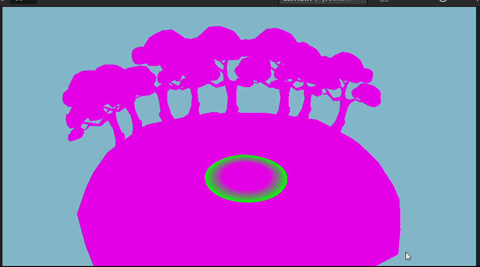
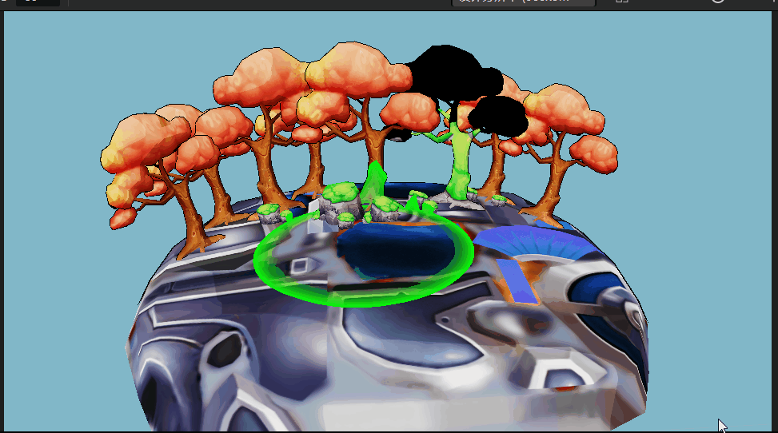

# 扫描 Shader 实现

扫描 shader 是采用深度图来实现的。对于深度图不熟悉的小伙伴可以查看麒麟子深度图详解文章来了解（[参考文献](#参考文献)）。

## 简介

通过深度图，记录像素在世界坐标内的深度，通过PostEffect，比较扫描圆心和当前像素点的世界坐标轴的位置，得出是否要绘制扫描像素。

该功能可以用于类似于赛尔带内地图扫描，丢手雷时的爆炸范围的模拟。

## 目录介绍

- material、model、skybox 皆为 Cocos 内置资源
- scene 目录：
  - worldPositionScan:从某个位置开始扫描
  - generatorExample：手雷爆炸或者爆炸范围演示
- depth-write: 写入深度图的材质和着色器
- position-scan：通过世界坐标位置进行扫描的着色器与材质
- render-depth: 记录深度的 RenderTexture
- render-scene： 记录当前场景渲染的 RenderTexture
- video 目录：示例视频

## 预览方式

打开上述场景，选择运行游戏即可。

- worldPositionScan：点击小岛任意位置，会出现扫描圈
- generatorExample：按下鼠标左键并移动，扫描圈会跟随鼠标进行移动

由于使用了PostEffect，因此在编辑器模式无法查看到正确的结果。

## 使用方法

### 创建相机

搭建场景需要两个相机：Main Camera 以及 CaptureDepthCamera。

Main Camera 用于绘制整个场景

CaptureDepthCamera 用于记录场景深度值

> **注意**：请确保 CaptureDepthCamera 是 MainCamera 的子节点，确保他们除了 Priority、Visiblity、ClearFlags 的属性外，其他属性相同。

在层级内添加 `DEPTH_WRITE` 层级，并确保 CaptureDepthCamera 的 `Visiblity` 属性 **只有** `DEPTH_WRITE` 层级，并且其他相机的 `Visiblity` 不含 `DEPTH_WRITE` 层级。

将 render-scene 这张RT 赋予给 MainCamera 的 `Target Textuer` 属性。
将 render-depth 这张RT 赋予给 CaptureDepthCamera 的 `Target Texture` 属性。

### 场景搭建

首先搭建好要绘制的场景节点。

将节点进行克隆并给克隆出的节点一个共同的父节点。同时修改克隆出的节点的层级为 `DEPTH_WRITE`。

给克隆出的所有不透明物体的材质修改为 `depth-write`。

### UI 搭建

创建1个sprite，并将其大小修改为全屏大小（通过 Widget 组件）。例子中的 Canvas 节点。

给该 sprite 的 **Custom Material** 属性赋予材质：position-scan.mtl
给该 sprite 的 **Sprite Frame** 属性赋予RT：render-scene

此步骤是使用UI系统，绘制一张全屏的 sprite，作为 PostEffect 的最终输出。

### 添加组件

选择任意可用节点添加 `GeneratorExample` 或 `WorldPositionScan` 组件，并修改对应的属性。

该组件由于使用了物理的射线检测，因此需确保 项目设置->功能剪裁 内的 3D 物理不为 Builtin 并且未被剪裁。

参考 islands 这个最顶层节点，添加碰撞体。

### 组件参数说明

`GeneratorExample` 或 `WorldPositionScan` 组件：

| 属性 | 说明 |
| :-- | :-- |
| **RenderRTSprite** | 上述步骤中的 sprite |
| **MainCamera** | 主相机 |
| **ScanSpeed** | 扫描的速度 |
| **ScanDistance** |  扫描的范围 |
| **maxScanDistance** | 最大扫描范围 |

#### 材质参数说明

- position-scan：

| 属性 | 说明 |
| :-- | :-- |
| **DepthMap** | 深度图 |
| **ScanDistance** | 扫描范围 |
| **ScanRange** | 扫描时带颜色的圈的范围 |
| **ScanColor** | 扫描的颜色|

确保勾选： SAMPLE_FROM_RT。

## 原理介绍

通过 depth-write 材质将物体的深度写入 render-depth 这张RT:

```glsl
float depth = sv_position.z / sv_position.w * 0.5 + 0.5;
return packDepthToRGBA(depth);
```

通过下列方法可以对深度图进行采样:

```glsl
vec4 depthCol = texture(depthMap, uv0);
depth = unpackRGBAToDepth(depthCol);
```

在 sprite 渲染时，由于sprite 是全屏的Quad，因此可以理解为是PoseEffect，通过计算视图矩阵的逆矩阵，与屏幕坐标的 xy 以及采样深度图获取的深度 depth 值作为位置，乘以逆矩阵后得出世界坐标系内的位置：

```glsl
vec4 screenPos = vec4(uv0.x * 2.0 - 1.0, uv0.y * 2.0 - 1.0, depth * 2.0 - 1.0, 1.0);
vec4 worldPos = matInvViewProj * screenPos;
worldPos = worldPos / worldPos.w;    
```

通过比对当前点击的世界坐标位置和当前像素的世界坐标位置，判定是否需要绘制扫描像素。

```glsl
float scanDistance = scanArgs.x;
float scanRange = scanArgs.y; 
if( dist < scanDistance && scanDistance - dist < scanRange ) {
  o = mix(o, scanColor, 1.0 - (scanDistance - dist)/ scanRange);
} 
```

## 参考文献

- [麒麟子 Cocos Shader入门基础七：一文彻底读懂深度图](https://blog.csdn.net/qq_36720848/article/details/123435771)
- [https://zhuanlan.zhihu.com/p/27547127](https://zhuanlan.zhihu.com/p/27547127)
- [https://zhuanlan.zhihu.com/p/143788955](https://zhuanlan.zhihu.com/p/143788955)

## 引擎版本

开发版本为：v3.6.0。

## 效果图



